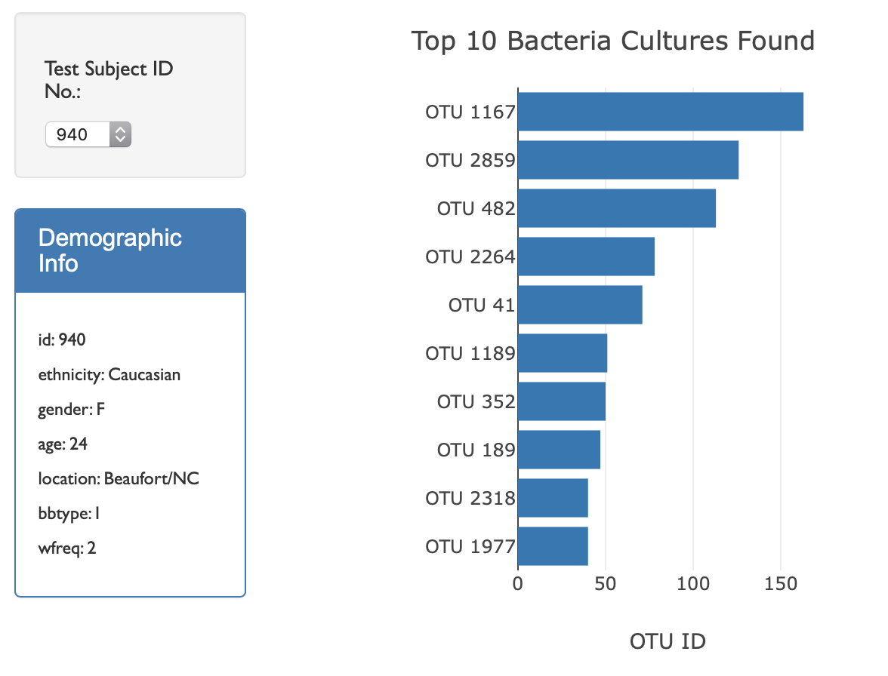
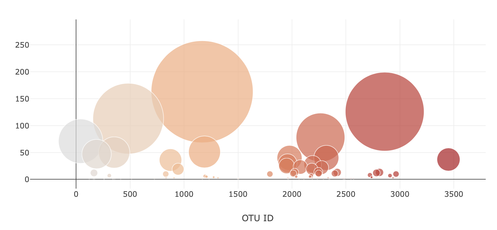

# Plotly Challenge

## Overview:
In this assignment, the microbial diversity that inhabit belly buttons was analyzed. Anteractive dashboard was created to visualize Belly Button Biodiversity using JavaScript and Plotly.

## Datasets:
The dataset is obtained from a study that catalogs the microbes that colonize human navels. The study characterizes the microbial species (also called operational taxonomic units, or OTUs) that were present in more than 70% of people.

## Workflow:

Each bacterial culture is classified by an OTU ID. OTU, or operational taxonomic units, are used to identify groups of bacteria with similar genetic sequences. 

## Graphs:
For each test subject, the top 10 bacterial cultures found in their navel are displayed in the bar graph. 

The bubble graph displays the top 10 bacterial cultures, but the marker size is determined by the amount of that bacterial culture compared to the other bacterial cultures found in that individual's navel.

